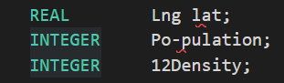

# Frequently Asked Questions

<i>  Where do I fine more information about LexisNexis Risk Solution? </i> \
LexisNexis information can be found [here](https://risk.lexisnexis.com/).

 

<i>  Where do I fine more information about HPCC Systems? </i> \
Please refer to [HPCC Systems](https://hpccsystems.com/) website.

 

<i>  Where do I fine more information about internship? </i> \
Please visit our [internship program](https://hpccsystems.com/blog/intern_program).

 

<i>  Where do I find more information about Connections Homes? </i> \
Please refer to [Connections Homes](https://connectionshomes.org/).

 

<i>  Information on building a Roxie Query? </i> \
[Working With Roxie](https://hpccsystems.com/training/documentation/programmers-guide/html/ProgGuide_WorkingWithRoxie.html%23Roxie_Overview) introduces you to what roxie query is. 

[STORED](https://hpccsystems.com/training/documentation/ecl-language-reference/html/STORED_workflow_service.html) shows you all the attribute you might need for your input fields. 

 

<i>  Can I see a Roxie example ? </i> \
Please see Roxie example and related information in [roxieSample](./Roxie.ecl)

 

<i>  Where do I find Mentors and Youth layout? </i> \
Mentors layout and dataset along with youth layout can be found in [inputRecords](./inputRecords.ecl).

 

<i>  What does Definition must contain EXPORT or SHARED value error mean? </i> \
It means your BWR doesn't have an OUTPUT or if it is a MODULE it doesn't have an EXPORT attribute. 

 

<i> Are modules executable?</i>  \
No. Modules can have exported values to be called and used outside the modules. 

<i>  What does result is too big to output error mean? </i> \
Means that the dataset you are trying to output is bigger than dedicated memory. You can wrap your OUTPUT with CHOOSEN( ) to solve this error.\
`OUTPUT(CHOOSEN(SampleDS, 150), NAMED('SampleDS));`\
For more information please refer to [CHOOSEN](https://hpccsystems-solutions-lab.github.io/hpcc/Tutorial/ECLSyntax/choosen). 

<i> Unknown identifier error when creating a record layout?</i>\
Field names in RECORD should not have spaces or subtraction sign `-`, or start with a numeric value. 

Following names are unacceptable.

