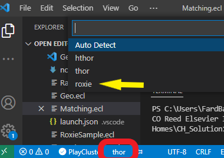

# Roxie Sample

You can copy/paste following code into an .ecl file and run it on Roxie cluster.


```java
SampleRec := RECORD
    REAL     Distance;     
    STRING   FirstName;     
    STRING   LastName;    
    STRING   ZipCode;     
    STRING   Region;      
    STRING   Birthday;      
    INTEGER  Age;     
    STRING   Race_Ethnicity;
    STRING   Religion;
    STRING   RoleofFaith;   
    STRING   AlcoholUse;
END;  


_Distance         := 0  : STORED('Distance', FORMAT(SEQUENCE(1)));
_FirstName        := '' : STORED('FirstName', FORMAT(SEQUENCE(2)));
_LastName         := '' : STORED('LastName', FORMAT(SEQUENCE(3)));
_ZipCode          := '' : STORED('ZipCode', FORMAT(SEQUENCE(7)));
_Region           := '' : STORED('Region', FORMAT(SEQUENCE(8)));
_Birthday         := '' : STORED('Birthday', FORMAT(SEQUENCE(9)));
_Age              := '' : STORED('Age', FORMAT(SEQUENCE(10)));
_Race_Ethnicity   := '' : STORED('Race_Ethnicity', FORMAT(SEQUENCE(11)));
Religion          := '' : STORED('Religion', FORMAT(SEQUENCE(12), 
                          SELECT('Christianity=Christianity,Islam=Islam,Judaism=Judaism,NA=NA')));
RoleofFaith       := '' : STORED('RoleofFaith', FORMAT(SEQUENCE(13)));
AlcoholUse        := '' : STORED('AlcoholUse', FORMAT(SEQUENCE(14), 
                          SELECT('Occasionally=Occasionally,Responsibly=Responsibly,Irresponsibly=Irresponsibly, NA=NA')));

SampleDS := DATASET([{_Distance, _FirstName,_LastName, _ZipCode, _Region, 
                     _Birthday, _Age, _Race_Ethnicity, Religion, RoleofFaith, AlcoholUse}], 
                     SampleRec);


OUTPUT(SampleDS, NAMED('SampleDS'));
OUTPUT(_FirstName  + _LastName, NAMED('FullName'));
OUTPUT(IF((INTEGER)_Age BETWEEN 10 AND 25, 'Not Eligiable', 'Eligible'), NAMED('isEligiable'));
```

Make sure that you run this job on `Roxie` cluster. 
Following shows how to choose Roxie in VS Code which is located on the bottom blue bar in VS Code. If ROxie isn't selected click on cluster name and pick Roxie. 



</br>

__Note__ Roxie is only used for jobs with user interface. Other jobs should be run using Thor, ot hThor. 

</br>

One job is executed open [ECL Watch Page](http://40.76.26.67:8010) and click on your WUID.


From WUID tab you can publish your job as a Roxie query.


Open the [Roxie page](http://40.76.26.67:8002) to review and test your job. 

__Input Interface__


</br>
</br>

__Output Interface__


